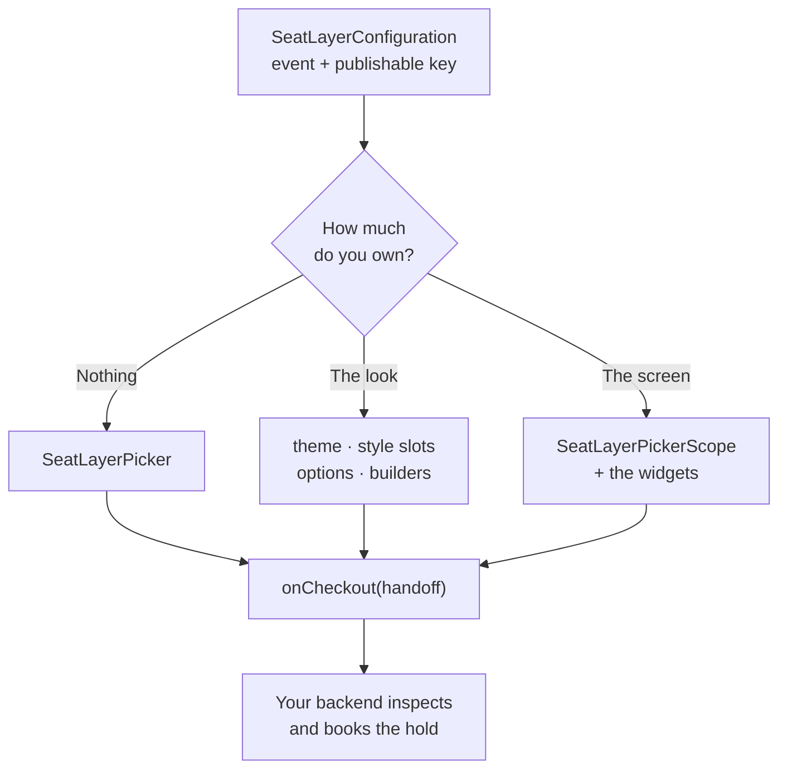

# SeatLayer Flutter Seat Map SDK for Reserved Seating

[](https://github.com/seatlayer/seatlayer-flutter/actions/workflows/ci.yml)
[](https://pub.dev/packages/seatlayer)
[](https://flutter.dev/)
[](https://dart.dev/)
[](LICENSE)

The official SeatLayer Flutter package for adding an interactive seating chart
and seat picker to ticketing apps on iOS and Android. Render live seat
availability, create temporary holds, find best-available seats, and hand
secure booking to your trusted server.

[SeatLayer Flutter package on pub.dev](https://pub.dev/packages/seatlayer) ·
[Flutter seat-map documentation](https://docs.seatlayer.io/buyer-sdk/flutter/) ·
[SeatLayer reserved-seating platform](https://seatlayer.io/) ·
[Buyer seat-map demo (web)](https://app.seatlayer.io/demo/play/grand-theatre) ·
[SeatLayer Android seat map SDK](https://github.com/seatlayer/seatlayer-android) ·
[SeatLayer React Native SDK](https://github.com/seatlayer/seatlayer-react-native) ·
[SeatLayer AI Toolkit](https://github.com/seatlayer/seatlayer-ai-toolkit)


> **Production SDK:** `0.3.1` is the current Flutter release. Pin the documented
> release and validate your event, checkout handoff, lifecycle, and supported
> physical devices before rollout.

## Works as a native picker

**Every piece of chrome is a Flutter widget.** The header, price rail, floor strip, section dock, seat confirm card,
cart sheet, checkout button and the captions over the 3D scene and the seat-view
panorama are all Dart — drawn in your palette, laid out by Flutter, replaceable
one at a time. The SeatLayer venue map draws the geometry: seats, labels,
section shells, the immersive scene and the panorama photograph. It knows
Flutter owns the furniture, so it draws none of its own: no second tooltip, no
second test badge, no duplicate button under a native one.

Three ways in, and they are a ladder — each level keeps what the one below gave
you. Level 2 is not an escape hatch and level 3 is not a rewrite: the drop-in is
built from exactly the widgets level 3 hands you.

| | You want | You write | You keep |
| --- | --- | --- | --- |
| **1** | The whole buyer flow, now | `SeatLayerPicker(…)` | Everything below |
| **2** | It, in your brand and your words | A theme, a style slot, an option, a builder | The layout, the flow, the holds |
| **3** | Your own screen | `SeatLayerPickerScope` + the widgets | Inventory, holds, snapshots, checkout |



## Quick start

```bash
flutter pub add seatlayer
```

```dart
import 'package:seatlayer/seatlayer.dart';

SeatLayerPicker(
  configuration: SeatLayerConfiguration(
    event: 'ev_your_event',
    publicKey: 'pk_test_your_key',
  ),
  themeMode: SeatLayerThemeMode.auto,
  onCheckout: (handoff) => bookOnYourBackend(handoff.holdId),
  onClose: () => Navigator.of(context).pop(),
)
```

That is the whole flow: live inventory, price and accessibility filters, section
and floor navigation, seat confirmation, GA and table prompts, Best Available,
the cart, a hold with its countdown, real venue 3D, the seat-view panorama and
the checkout handoff. It fills the bounded space its parent gives it — do not
nest it in a gesture-driven `ListView` or `SingleChildScrollView`.

`SeatLayerPickerPage(configuration:, onCheckout:)` is the same widget as a route
you push; `showSeatLayerPicker(context, configuration:, presentation:)` is it as
a modal returning the handoff, or `null` if the buyer closes it. `adaptive` is
edge-to-edge on a phone and a constrained dialog at 700 logical pixels or wider;
`.fullScreen` / `.dialog` force one. Both intercept close and system back and
release a picker-owned hold before the route leaves — a hold already handed to
you is never released.

**The renderer pin.** Each SDK release is pinned to a matching SeatLayer
renderer version — exported as `seatLayerHostedWebVersion` — so an app on a
given `seatlayer` version always gets the same renderer, and
`SeatLayerConfiguration(assetPath:)` points it elsewhere while you validate a
pre-release.

Register the SDK's renderer origin, `https://cdn.seatlayer.io` (exported as
`seatLayerMobileOrigin`), on the publishable key you use. For private,
login-gated, presale, partner or channel inventory, drop `publicKey` and mint a
short-lived, origin-bound buyer session from your own backend instead:

```dart
SeatLayerConfiguration(
  event: 'ev_private',
  buyerAccessTokenProvider: (request) =>
      buyerBackend.mintSeatLayerAccess(request.reason),
)
```

Never ship a SeatLayer secret in the app binary.

**Open faster.** Call `SeatLayerPicker.prewarm()` when the event screen appears
so the picker opens without a delay. It is safe to call on every build; an
unused prewarm is released after a few minutes or on memory pressure, and
`SeatLayerPicker.cancelPrewarm()` releases it early.

```dart
@override
void initState() {
  super.initState();
  SeatLayerPicker.prewarm();
}
```

## Customise the picker

Four levels, cheapest first. None of them rebuilds the layout or the flow.

**Colours and type — a theme.** One line adopts an app palette whole — before,
the SeatLayer palette; after, yours, on the chrome and the drawn map together:

```dart
theme: SeatLayerPickerThemeData.fromColorScheme(Theme.of(context).colorScheme),
```

**One control's shape — a style slot.** Every surface the picker draws has a
slot on the theme, so one control changes without replacing the widget:

```dart
// before: the picker's 8-pt button radius everywhere.
// after: only the checkout action is a pill; every other button is untouched.
theme: SeatLayerPickerThemeData.light(
  styles: SeatLayerPickerStyles(
    continueButtonStyle: FilledButton.styleFrom(shape: const StadiumBorder()),
  ),
)
```

Slots: `primaryButtonStyle`, `secondaryButtonStyle`, `continueButtonStyle`,
`iconButtonStyle`, `chipShape`, `legendChipStyle`, `floorStripStyle`,
`seatViewChromeStyle`, `dockBarStyle`, `confirmCardStyle`, `sheetStyle`,
`headerStyle`, `pillStyle`. Button slots take a Material `ButtonStyle`; surface
slots take a `SeatLayerSurfaceStyle` (colour, shape, elevation, padding, type).
Every widget owning a slot also takes `style:`, which wins for that one instance
— `SeatLayerDockBar(style: SeatLayerSurfaceStyle(shape: …))`.

**Sizes, visibility and words — layout, chrome switches, strings.** The spec's
numbers are defaults, not constants, and every buyer-facing string is an
override:

```dart
// before: the approved phone metrics and English defaults.
// after: a taller dock, no floor strip, French wording.
theme: const SeatLayerPickerThemeData.light(
  layout: SeatLayerPickerLayout(dockBarHeight: 60, sheetMaxHeightFraction: .5),
),
options: SeatLayerPickerOptions(
  chrome: const SeatLayerPickerChromeOptions(showFloorStrip: false),
  strings: SeatLayerPickerStrings(holdAndCheckout: 'Réserver et payer'),
),
```

Or take the thirty-seven translations SeatLayer already ships, from the same
reviewed dictionaries the drawn map uses:
`strings: SeatLayerPickerStrings.forLocale(Localizations.localeOf(context))`.
It resolves by language, and by script for Chinese; an untranslated locale — and
any entry with no runtime wording, currently just `allFloors` — keeps its
English default, and the result is an ordinary `SeatLayerPickerStrings` you can
still override on top of.

**One whole part — a builder slot.** The builder receives the live state, the
controller and the widget the drop-in would have rendered:

```dart
// before: the picker's own cart sheet. after: yours, the rest untouched.
builders: SeatLayerPickerBuilders(
  cartSheet: (context, part) =>
      MyOwnSheet(state: part.state, fallback: part.defaultChild),
),
```

Slots: `map`, `header`, `legend`, `floorStrip`, `sectionNavigator`, `dockBar`,
`accessibilityFilters`, `mapControls`, `selectionTray`, `cartSheet`,
`checkoutBar`, `venue3D`, `seatViewChrome`.

The test badge and the required attribution have no builder slot: colours and
type follow your theme, but required chrome cannot be returned as an empty
widget — a white-label entitlement turns attribution off, server-side. Organizer
ticket categories are likewise never rebranded, because they mean a price.

## Build your own layout

Place a `SeatLayerPickerScope` and arrange the widgets yourself. Each reads its
own state from the scope, so nothing needs the drop-in layout:

```dart
SeatLayerPickerScope(
  configuration: configuration,
  themeMode: SeatLayerThemeMode.auto,
  child: Column(children: [
    SeatLayerPickerHeader(compact: true, onClose: close),
    const Expanded(child: Stack(children: [
      Positioned.fill(child: SeatLayerChart()),
      Positioned(top: 8, left: 0, child: SeatLayerPriceLegend(compact: true)),
      Positioned(top: 40, left: 0, right: 0, child: SeatLayerFloorStrip()),
      Positioned.fill(child: SeatLayerPickerMapControls(compact: true)),
      Positioned(left: 0, right: 0, bottom: 0, child: SeatLayerDockBar()),
      Positioned.fill(child: SeatLayerVenue3D()),
      Positioned.fill(child: SeatLayerSeatViewChrome()),
    ])),
    SeatLayerCartSheet(expanded: expanded, onCheckout: book,
        onExpandedChanged: (v) => setState(() => expanded = v)),
  ]),
)
```

**Every action is a callback.** All optional; a picker with none is still a
complete buyer flow:

```dart
callbacks: SeatLayerPickerCallbacks(
  onReady: (info) => debugPrint('ready in ${info.timeToReadyMs} ms'),
  onSelectionChanged: (seats) => setState(() => _seats = seats),
  onSectionFocused: (id) => analytics.log('section', id),
  onHoldChanged: (hold, handoff) => _armCountdown(hold),
  onContinue: (handoff) => analytics.log('checkout', handoff.holdId),
  onError: (error) => report(error),
)
```

Also `onSeatSelected`, `onSeatRemoved`, `onSeatViewOpened`,
`onSelectionValidityChanged`, `onHoldExpired`, `onAccessExpired`,
`onAccessUnavailable`, `onSelectedObjectUnavailable`, `onThemeResolved`,
`onClosed`.

**Drive it directly.** The controller speaks typed Dart methods:

```dart
await picker.selectObjects(['A-12', 'A-13']);
await picker.setMaxSelection(4);
await picker.focusSection('section-a');
await picker.setFloor('mezzanine');     // or picker.showAllFloors()
await picker.showSeatIn3D(seat);        // enter or retarget without remounting
await picker.openSeatView(seat);        // authored 360° or drawn preview
await picker.setViewportInsets(insets); // frame clear of your own chrome
```

Dispose a controller you created, and `await picker.close()` first so a
picker-owned hold is acknowledged as released.

**Cover the map safely.** An `IgnorePointer` is not enough on iOS — UIKit can
hit-test the venue map beneath composited Flutter chrome — so bracket your own
overlay with `await picker.setMapInteractionEnabled(false)` and `true` in a
`finally`, which makes the map itself inert. The turnkey layout already does
this around its decision chrome. Do not wrap the map in an app-level drag or
scale recognizer and do not forward raw touch coordinates to it: both fight the
map's own tap-versus-pan suppression.

**One back gesture, one ladder.** Android predictive back and the iOS edge swipe
both reach the picker's `PopScope`, which walks seat card → section → overview →
dismiss rather than leaving on the buyer's first try out. **Haptics** fire one
cue on selection, removal, a section landing, a hold and a hold expiry, decided
off the snapshot so they never buzz twice for one seat;
`SeatLayerPickerOptions(haptics: false)` turns them off.

## Theme

`themeMode` resolves in one order: **your `themeMode` → your app's theme → the
device.** `auto` reads `Theme.of(context).brightness` first, so it tracks the
dark-mode switch inside your app — the setting the buyer actually chose — and
falls back to `MediaQuery.platformBrightness` only when no Material or Cupertino
theme sits above the picker. Either reading is live: flip your app's theme or
the device appearance and the chrome **and the drawn map** repaint together, no
reload, no lost selection, no moved camera.

```dart
themeMode: SeatLayerThemeMode.auto,
theme: const SeatLayerPickerThemeData(accent: Color(0xFFE54558)),
```

The default constructor sets only the roles you name, so every ground role still
comes from `themeMode`. **A preset pins the mode:**
`SeatLayerPickerThemeData.light()` and `.dark()` are complete ground palettes —
each also sends a contrast-paired `SeatLayerMapThemeData` for the canvas
background, row labels, free text and the selection ring — and an explicit
ground outranks a resolved mode, so `themeMode: auto` with `.light()` never goes
dark. Reach for a preset when you want one fixed side; pick the preset yourself
if you want both.

The status and navigation bars are the picker's surface, so the picker dresses
them — light glyphs on a dark picker, dark on a light one, dark for the
immersive scene either way, re-evaluated on every `auto` flip.
`SeatLayerPickerChromeOptions(manageSystemOverlays: false)` opts out;
`seatLayerPickerOverlayStyle(resolvedTheme)` still says what it would have set.

## Checkout handoff

The app selects and holds inventory. Your trusted backend inspects and books the
hold after payment or order validation.

`SeatLayerCheckoutHandoff` carries an opaque `holdId`, the server expiry, the
currency, priced line items with object/category/tier identity and seat address,
and a display total. The ordinary picker snapshot deliberately does **not**
contain the `holdId`: it says only whether a hold is active, when it expires and
who owns it. The capability crosses into Dart at the handoff and nowhere else.

- Never ship a SeatLayer secret in the app.
- Never put buyer tokens or hold ids in logs, analytics or URLs.
- Send the `holdId` only to your trusted checkout backend.
- Inspect the hold server-side and calculate the charge from server data.
- Reuse a stable host order id as the booking reference for safe retries.

Checkout transfers ownership: closing the picker afterwards must not release the
hold, while closing *before* handoff releases a picker-owned one. Process
termination cannot guarantee a release, so the server TTL is the final boundary.
If a turnkey `onCheckout` throws, the picker rejects the handoff before
surfacing your error — it can release only the exact hold that session just
handed over. A custom flow rolls back the same way:

```dart
final handoff = await picker.checkout();
try {
  await openCheckout(handoff);
} catch (_) {
  await picker.rejectCheckoutHandoff(handoff);
  rethrow;
}
```

`SeatLayerPickerOptions(initialHoldId:)` always restores a **host-owned** hold;
ownership is not caller-configurable and picker cart controls never release it.
`readOnly: true` inspects a map, selection or restored hold with inventory
changes refused in the runtime *and* in the controller, which fails such a call
with a typed `read_only` error rather than relying on hidden UI. Continue with
[holds and secure server-side checkout](https://docs.seatlayer.io/buyer-sdk/holds-and-checkout/).

## Widget catalogue

Every widget below works standalone inside a `SeatLayerPickerScope`.

| Widget | What it draws |
| --- | --- |
| `SeatLayerChart` | The map itself (alias of `SeatLayerPickerMap`) |
| `SeatLayerPickerHeader` | Event identity, hold pill, dismiss |
| `SeatLayerPriceLegend` | Price chips that filter the map |
| `SeatLayerFloorStrip` | Floor chips on a multi-floor venue |
| `SeatLayerDockBar` | Focused section, seats left, prev/next, Venue |
| `SeatLayerPickerMapControls` | Accessibility, fit, Map/3D in the corners |
| `SeatLayerConfirmCard` | The phone's one-seat decision card |
| `SeatLayerCartSheet` | Peek bar and content-height cart |
| `SeatLayerCartList` | The dense ticket list with run folding |
| `SeatLayerBestSeatsForm` | Two selects, a stepper, one action |
| `SeatLayerBookButton` | The full-width checkout call to action |
| `SeatLayerVenue3D` | Caption, seat stepper and exits over the 3D scene |
| `SeatLayerSeatViewChrome` | Caption strip and badge over the panorama |
| `SeatLayerPickerAccessibilityFilters` | Access needs, colourblind palette |
| `SeatLayerPickerTablePrompt` / `…GeneralAdmissionPrompt` | Quantity prompts |
| `SeatLayerPickerSectionNavigator` | Section list and stepping |
| `SeatLayerPickerTestModeIndicator` | The one test-event badge |
| `SeatLayerPickerAttribution` | `Powered by SeatLayer`, when required |

The individual corner controls (`…ZoomInButton`, `…ZoomToFitButton`,
`…ViewModeControl`, `…ColorblindButton`, `…OverviewButton`,
`…3DNavigationModeButton`), the status views (`…LoadingView`, `…ErrorView`,
`…EmptyView`, `…ActionError`) and the seat inspection buttons
(`…SeatViewButton`, `…Seat3DButton`) are exported too, all prefixed
`SeatLayerPicker`. Each is absent rather than decorative when the venue map
does not support what it drives.

`SeatLayerView` remains for an application that owns *all* buyer chrome,
selection presentation and hold orchestration itself: the stable, source-
compatible `0.2.x` surface, with raw hold/selection/view commands and typed
event streams.

The picker fails closed rather than showing a control that quietly does
nothing, and it reads one immutable state snapshot at a time: stale state is
dropped, and inventory-changing actions are serialized, repeated checkout taps
included. Private buyer tokens stay in memory and never enter a snapshot. See
[the picker architecture](doc/mobile-picker-architecture.md) for the layers,
ownership rules and validation gates.

## Design system

The picker's colours, sizes, radii, elevations, type scale, motion table, haptic
cues and default strings live in one platform-neutral file,
[`design/tokens.json`](design/tokens.json); the catalogue describing every widget
in terms of those tokens is [`design/components.md`](design/components.md),
written so a Swift, Kotlin or React Native engineer can reproduce the design.

`lib/src/picker/picker_tokens.g.dart` is **generated** from that JSON by
`dart run tool/gen_tokens.dart` (`--check` fails if it is stale) and must not be
hand-edited. The presets, `SeatLayerPickerLayout`, `SeatLayerPickerMotion`, the
haptic map and `SeatLayerPickerStrings` all read the file, and
`design_tokens_test.dart` asserts them against it, so the two cannot drift.

## Frequently asked questions

### How do I add a seat map to a Flutter app?

Add the [`seatlayer` package](https://pub.dev/packages/seatlayer) and place a
`SeatLayerPicker` with your event key on a route. That is the whole buyer flow —
map, filters, seat confirmation, cart, holds and the checkout handoff. The quick
start above is complete; the
[Flutter seat-map integration guide](https://docs.seatlayer.io/buyer-sdk/flutter/)
covers lifecycle, commands and events in depth. `SeatLayerView` remains for an
app that wants only the raw map and owns every control itself.

### Is SeatLayer a Flutter widget or only a JavaScript snippet?

It is a native Flutter picker — every control is a Flutter widget.

### Which Flutter platforms are supported?

The package declares and supports iOS and Android. It does not currently claim
Flutter web, macOS, Windows, or Linux support.

### How does seat booking work in a Flutter ticketing app?

The app never books seats or processes payment directly. It selects inventory
and creates a temporary hold. Send the opaque `holdId` to your trusted backend,
calculate the charge from server-inspected hold items, process the order, and
book with a stable `bookingRef`.

### How do temporary seat holds work?

When a buyer selects seats, the SDK creates a temporary hold that reserves the
inventory against concurrent buyers for a limited window. The hold expires
automatically if checkout does not complete — `onHoldExpired` tells the app to
return the buyer to the map — and `extendHold` and `resumeHold` cover longer
checkouts and app restarts. This prevents double-selling without locking seats
forever.

### Can I use my own payment provider?

Yes. SeatLayer never processes payment inside the seat map. The app hands the
`holdId` to your backend, and your backend charges through any payment
provider you already use — Stripe, Adyen, Razorpay, or your own — before
booking the hold through the
[server-side checkout flow](https://docs.seatlayer.io/buyer-sdk/holds-and-checkout/).

### Can I try the Flutter seat map without a SeatLayer account or API key?

Yes. The repository's example app runs on a packaged offline fixture — no
account, event key or backend needed — and exercises the real Flutter view,
venue map, commands and event streams. The fixture lives with the example
rather than in the published package, so it costs your app nothing.
Create a free SeatLayer test event when you are ready to validate live
inventory, holds, expiry, conflicts and checkout.

### Can I restyle the picker without rebuilding it?

Yes, at four levels that all keep the layout and the flow: a theme (or
`SeatLayerPickerThemeData.fromColorScheme` for an app palette), a per-surface
style slot and per-widget `style:`, the layout/chrome/strings options, and a
builder slot that replaces one whole part while the rest stays. See
[Customise the picker](https://docs.seatlayer.io/buyer-sdk/flutter/customise/).

### Can I build a completely different seat-picker layout?

Yes. `SeatLayerPickerScope` plus the composable widgets is a supported path, not
an escape hatch: the drop-in is built from exactly those widgets, and you keep
inventory, holds, snapshots and the checkout handoff. See
[Build your own layout](https://docs.seatlayer.io/buyer-sdk/flutter/custom-layout/).

### Does the Flutter seat map support light and dark mode?

Yes, live. `SeatLayerThemeMode.auto` follows your app's theme first and the
device second, and repaints the Flutter chrome and the drawn map together —
without reloading, without losing the selection and without moving the camera.
A `.light()` or `.dark()` preset pins one side deliberately.

## Continue your Flutter integration

- [Follow the Flutter seat-map integration guide](https://docs.seatlayer.io/buyer-sdk/flutter/)
  for setup, lifecycle, commands, events, and runtime requirements.
- [Customise the picker](https://docs.seatlayer.io/buyer-sdk/flutter/customise/)
  with themes, style slots, layout metrics, strings and builder slots.
- [Build your own layout](https://docs.seatlayer.io/buyer-sdk/flutter/custom-layout/)
  from the composable widgets under a `SeatLayerPickerScope`.
- [Read the picker architecture](https://docs.seatlayer.io/buyer-sdk/flutter/architecture/)
  for the layers, the snapshot model and chrome ownership.
- [Connect seat holds to secure server-side checkout](https://docs.seatlayer.io/buyer-sdk/holds-and-checkout/)
  without exposing booking credentials in the app.
- [Run the complete checkout example](https://docs.seatlayer.io/examples/complete-checkout/)
  to connect the buyer hold id to payment and idempotent booking.
- [Compare SeatLayer's mobile seat map SDKs](https://docs.seatlayer.io/buyer-sdk/mobile/)
  when choosing between Flutter, React Native, and the native iOS and Android
  packages.
- [Explore the 3D seating chart for web buyers](https://seatlayer.io/3d-seat-map/)
  as a separate browser capability when comparing the wider buyer experience.
- [Point AI coding agents at the SeatLayer docs index](https://docs.seatlayer.io/llms.txt)
  (`llms.txt`) for an agent-readable map of the documentation.

## SeatLayer SDK ecosystem

| Surface | Package or source |
| --- | --- |
| Flutter | [`seatlayer`](https://pub.dev/packages/seatlayer) (this package) |
| JavaScript | [`@seatlayer/js`](https://www.npmjs.com/package/@seatlayer/js) |
| React | [`@seatlayer/react`](https://www.npmjs.com/package/@seatlayer/react) |
| React Native | [`@seatlayer/react-native`](https://www.npmjs.com/package/@seatlayer/react-native) |
| iOS | [`seatlayer-ios`](https://github.com/seatlayer/seatlayer-ios) |
| Android | [`seatlayer-android`](https://github.com/seatlayer/seatlayer-android) |
| Server SDKs | [Node.js, Python, PHP, Ruby, .NET, Java, and Go](https://docs.seatlayer.io/server-sdk/install/) |

## Development

```bash
flutter pub get
flutter analyze
flutter test
flutter test --tags golden        # recorded and enforced on macOS
dart run tool/gen_tokens.dart     # after editing design/tokens.json
dart pub publish --dry-run
```

Verification stays proportional to the changed behaviour. Live checkout and
buyer credentials belong only in protected, manually dispatched end-to-end
validation.

## License

MIT © SeatLayer
