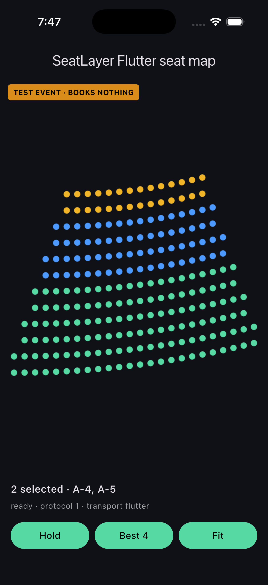

# SeatLayer Flutter Seat Map SDK for Reserved Seating

[](https://github.com/seatlayer/seatlayer-flutter/actions/workflows/ci.yml)
[](https://pub.dev/packages/seatlayer)
[](https://flutter.dev/)
[](https://dart.dev/)
[](LICENSE)

The official SeatLayer Flutter package for adding an interactive seating chart
and seat picker to ticketing apps on iOS and Android. Render live seat
availability, create temporary holds, find best-available seats, and hand
secure booking to your trusted server.

[SeatLayer Flutter package on pub.dev](https://pub.dev/packages/seatlayer) ·
[Flutter seat-map documentation](https://docs.seatlayer.io/buyer-sdk/flutter/) ·
[SeatLayer reserved-seating platform](https://seatlayer.io/) ·
[Buyer seat-map demo (web)](https://app.seatlayer.io/demo/play/grand-theatre) ·
[SeatLayer Android seat map SDK](https://github.com/seatlayer/seatlayer-android) ·
[SeatLayer React Native SDK](https://github.com/seatlayer/seatlayer-react-native) ·
[SeatLayer AI Toolkit](https://github.com/seatlayer/seatlayer-ai-toolkit)

> **Production SDK:** `0.2.2` is the current Flutter release. Pin the documented
> release and validate your event, checkout handoff, lifecycle, and supported
> physical devices before rollout.

## Install

```bash
flutter pub add seatlayer
```

Or add it to `pubspec.yaml`:

```yaml
dependencies:
  seatlayer: ^0.2.2
```

Then import the public library:

```dart
import 'package:seatlayer/seatlayer.dart';
```

## Quick start

Create one controller for the lifetime of the view. Give the map a definite
height or place it full-screen.

```dart
final controller = SeatLayerController();

@override
Widget build(BuildContext context) {
  return SizedBox(
    height: 640,
    child: SeatLayerView(
      controller: controller,
      configuration: SeatLayerConfiguration(
        event: 'ev_your_event_key',
        currency: 'USD',
      ),
      onReady: (info) {
        debugPrint(
          'SeatLayer ready: protocol=${info.protocolRevision} '
          'mode=${info.mode.raw}',
        );
      },
    ),
  );
}

@override
void dispose() {
  controller.dispose();
  super.dispose();
}
```

Drive buyer actions through the controller:

```dart
try {
  final hold = await controller.bestAvailable(4);
  if (hold != null) {
    beginCheckoutOnYourServer(hold.holdId);
  }
} on SeatLayerError catch (error) {
  // Handle sold_out, not_enough_together, expired holds, and other
  // recoverable inventory outcomes in the buyer UI.
  showSeatError(error.code, error.message);
}
```

Subscribe to strongly typed event streams:

```dart
controller.onSelectionChanged.listen(updateSelectedSeats);
controller.onHold.listen(persistHold);
controller.onHoldExpired.listen(returnBuyerToMap);
controller.onError.listen(reportSeatLayerError);
```

For private channel inventory, mint short-lived sessions on your backend for
the exact allowed origin `https://cdn.seatlayer.io`:

```dart
final configuration = SeatLayerConfiguration(
  event: 'ev_private',
  buyerAccessTokenProvider: (context) =>
      buyerBackend.mintSeatLayerAccess(context.reason),
);
```

## Flutter seat map in action



This capture comes from the repository's runnable Flutter example using the
packaged offline fixture. Run `flutter run` from `example/` to exercise the
real Dart bridge and buyer renderer without a live event key. The separate
[buyer seat-map demo](https://app.seatlayer.io/demo/play/grand-theatre) is a
browser preview of the wider SeatLayer buyer experience, not a Flutter app.

## Security boundary

The Flutter app **selects and holds** inventory. Your trusted backend **inspects
and books** the hold after payment or order validation.

- Never ship a SeatLayer secret key in the app binary or WebView.
- Send only the `holdId` and your normal checkout context to your backend.
- Calculate the charge from server-inspected hold items, not app input.
- Reuse your stable order id as `bookingRef` for safe booking retries.

Continue with
[seat holds and secure server-side checkout](https://docs.seatlayer.io/buyer-sdk/holds-and-checkout/)
before connecting payment and booking.

## Flutter runtime and WebView architecture

Production views load the immutable
`seatlayer-js@0.67.14/mobile.html` document and its lazy assets from
`https://cdn.seatlayer.io` inside `webview_flutter`. This gives iOS and Android
one canonical HTTPS origin for origin-bound buyer sessions. Tokens stay in
memory and are never put in page URLs or events. Explicit bundled fixture pages
remain supported for demos and tests and are pinned to the same verified
`0.67.14` release.

The public contract matches the Web and iOS SDKs:

- commands return `Future` values and throw typed `SeatLayerError` failures;
- events arrive through typed Dart streams;
- protocol negotiation fails clearly when an app update is required; and
- unknown future enum values and events remain forward-compatible.

## Commands

`hold` · `resumeHold` · `extendHold` · `release` · `releaseLabels` ·
`bestAvailable` · `holdGA` · `setSeatTier` · `getSelection` ·
`selectObjects` · `deselectObjects` · `clearSelection` · `selectCategories` ·
`deselectCategories` · `setSelectableObjects` · `setMaxSelection` ·
`getSelectionValidity` · `refreshAccess` · `getCurrentHold` · `getGAAreas` ·
`getFloors` · `setFloor` · `setColorblindSafe` · `setViewMode` ·
`getViewMode` · `zoomIn` · `zoomOut` · `zoomToFit` · `destroy`

## Event streams

`onReady` · `onSelectionChanged` · `onSelectionValidityChanged` ·
`onSelectionValid` · `onSelectionInvalid` · `onSelectionLimit` ·
`onBuyerAccessExpired` · `onBuyerAccessUnavailable` ·
`onSelectedObjectsUnavailable` · `onHold` · `onHoldRestored` · `onHoldExpired` ·
`onError` · `onHint` · `onGAClick` · `onSeatHover` · `onDeckTap` ·
`onUnknownEvent`

## Layout requirement

Do not place the seat map inside `ListView`, `SingleChildScrollView`, or another
gesture-driven scrolling surface. The canvas owns pan and pinch gestures for map
navigation. Use a fixed-height `SizedBox`, an `Expanded` child with a resolved
height, or a full-screen route.

## Run the example

```bash
cd example
flutter run
```

The example uses the SDK's offline fixture to exercise the real bridge and
renderer without a live event key. For an end-to-end integration, provide a test
event and keep the default API origin.

## Frequently asked questions

### How do I add a seat map to a Flutter app?

Add the [`seatlayer` package](https://pub.dev/packages/seatlayer), place a
`SeatLayerView` with your event key in the widget tree, and keep one
`SeatLayerController` for the lifetime of the view. The quick start above is a
complete interactive seating chart with live availability; the
[Flutter seat-map integration guide](https://docs.seatlayer.io/buyer-sdk/flutter/)
covers lifecycle, commands, and events in depth.

### Is SeatLayer a Flutter widget or only a WebView snippet?

`SeatLayerView` is a Flutter widget with a typed Dart controller. On iOS and
Android it uses `webview_flutter` to load SeatLayer's immutable hosted mobile
runtime, while application code works through Dart commands, payloads, errors,
and event streams.

### Which Flutter platforms are supported?

The package declares and supports iOS and Android. It does not currently claim
Flutter web, macOS, Windows, or Linux support.

### How does seat booking work in a Flutter ticketing app?

The app never books seats or processes payment directly. It selects inventory
and creates a temporary hold. Send the opaque
`holdId` to your trusted backend, calculate the charge from server-inspected
hold items, process the order, and book with a stable `bookingRef`.

### How do temporary seat holds work?

When a buyer selects seats, the SDK creates a temporary hold that reserves the
inventory against concurrent buyers for a limited window. The hold expires
automatically if checkout does not complete — `onHoldExpired` tells the app to
return the buyer to the map — and `extendHold` and `resumeHold` cover longer
checkouts and app restarts. This prevents double-selling without locking seats
forever.

### Can I use my own payment provider?

Yes. SeatLayer never processes payment inside the seat map. The app hands the
`holdId` to your backend, and your backend charges through any payment
provider you already use — Stripe, Adyen, Razorpay, or your own — before
booking the hold through the
[server-side checkout flow](https://docs.seatlayer.io/buyer-sdk/holds-and-checkout/).

### Can I try the Flutter seat map without a SeatLayer account or API key?

Yes. The repository example runs on a packaged offline fixture — no account,
event key, or backend needed — and exercises the real Flutter view, bridge,
renderer, commands, and event streams. Create a free SeatLayer test event when
you are ready to validate live inventory, holds, expiry, conflicts, and
checkout.

## Continue your Flutter integration

- [Follow the Flutter seat-map integration guide](https://docs.seatlayer.io/buyer-sdk/flutter/)
  for setup, lifecycle, commands, events, and runtime requirements.
- [Connect seat holds to secure server-side checkout](https://docs.seatlayer.io/buyer-sdk/holds-and-checkout/)
  without exposing booking credentials in the app.
- [Run the complete checkout example](https://docs.seatlayer.io/examples/complete-checkout/)
  to connect the buyer hold id to payment and idempotent booking.
- [Compare SeatLayer's mobile seat map SDKs](https://docs.seatlayer.io/buyer-sdk/mobile/)
  when choosing between Flutter, React Native, and the native iOS and Android
  packages.
- [Explore the 3D seating chart for web buyers](https://seatlayer.io/3d-seat-map/)
  as a separate browser capability when comparing the wider buyer experience.
- [Point AI coding agents at the SeatLayer docs index](https://docs.seatlayer.io/llms.txt)
  (`llms.txt`) for an agent-readable map of the documentation.

## SeatLayer SDK ecosystem

| Surface | Package or source |
| --- | --- |
| Flutter | [`seatlayer`](https://pub.dev/packages/seatlayer) (this package) |
| JavaScript | [`@seatlayer/js`](https://www.npmjs.com/package/@seatlayer/js) |
| React | [`@seatlayer/react`](https://www.npmjs.com/package/@seatlayer/react) |
| React Native | [`@seatlayer/react-native`](https://www.npmjs.com/package/@seatlayer/react-native) |
| iOS | [`seatlayer-ios`](https://github.com/seatlayer/seatlayer-ios) |
| Android | [`seatlayer-android`](https://github.com/seatlayer/seatlayer-android) |
| Server SDKs | [Node.js, Python, PHP, Ruby, .NET, Java, and Go](https://docs.seatlayer.io/server-sdk/install/) |

## Development

```bash
flutter pub get
flutter analyze
flutter test
dart pub publish --dry-run
```

## License

MIT © SeatLayer
